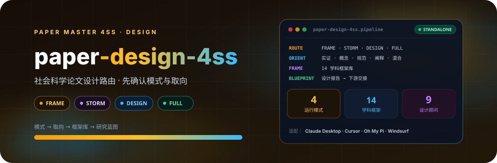

  

# Paper 研究设计 4SS（design 模块独立版）

社会科学论文设计路由系统。保留 FRAME、STORM、DESIGN、FULL 的拆分版操作流程；模式确认后强制确认研究取向，并在原流程内支持实证、概念/解释理论、规范理论、思想史/文本阐释与混合设计。

本包由 `paper-master-4ss/scripts/export_standalone.py` 从总控包 `paper-master-4ss/modules/design/` 自动导出：

- 包内相对路径相对本包根目录解析；
- `master/` 与 `references/` 中的协议/治理文件是导出时拷贝的快照；
- 跨模块路径 `paper-master-4ss/modules/<x>/...` 相对同级安装的总控包解析；
- 更新方式：修改总控包对应模块后运行
  `python3 paper-master-4ss/scripts/export_standalone.py design` 重新导出，勿直接编辑本包。

## 它做什么

把研究主题路由到学科框架库，并在 FRAME / STORM / DESIGN / FULL 四种模式中选一条执行。模式确认后必须再确认研究取向（实证、概念/解释理论、规范理论、思想史/文本阐释、混合），不预设理论或实证。

## 四种模式

| 模式 | 用途 |
|---|---|
| FRAME | 框架锚定与学科定位 |
| STORM | 跨学科头脑风暴 |
| DESIGN | 研究设计蓝图 |
| FULL | 从框架走到完整设计 |

## 使用

将本目录安装为宿主 skill（与 `paper-master-4ss` 总控包同级）。入口见 `SKILL.md`。先读 `references/researcher-agency-overlay.md`。
